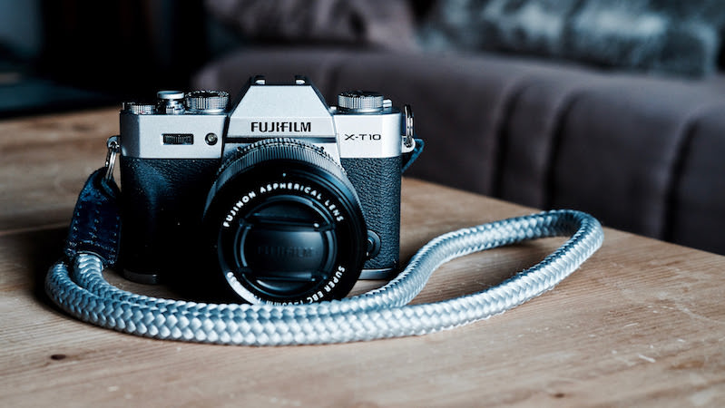

# Episode #1 of 10 - Cameras

Welcome to "Improving your photography skills." In the following 10 lessons, we will learn how to give your photographs the wow factor. We will look at the technical settings, but more importantly, we will look at composition and subjects, time of day, and backgrounds—all without a chart in sight! Enjoy!

The type of camera you have does not determine how good the photographs will be; it's the photographer that makes the photograph. This course will show you how to get the best out of the camera you already have, whether that is a camera on a phone, a point and shoot, an expensive professional camera, or anything in between.

Some cameras let you alter the settings, and others are fully automatic. We will be discussing the settings in the following lessons, but don't get too hung up on the numbers—this isn't a math course! Just go out and shoot, have fun, and enjoy the results.

	"The type of camera you have does not determine how good your photographs will be."

## Camera phones

Camera phones are probably the most accessible camera we have, as they're almost always with us. The quality of these cameras is improving with every iteration. Have a look at the camera applications available for your phone; some of them will allow you to alter more settings than the native application. We want to control the shutter speed and ISO along with exposure compensation and manual focusing, as this will give us more creative control over the final image.

## Point and shoot cameras

Point and shoot refers to cameras that are used largely on automatic mode and have a fixed lens. They are simple and quick to use. They are usually smaller than cameras with interchangeable lenses, which makes them great for travelling. They often have modes for particular scenes like landscape and sports.

## Cameras with interchangeable lenses

Cameras that have interchangeable lenses allow for much more flexibility. From focusing on faraway objects to tiny details, from big landscapes to portraits of people—your photography can grow and evolve without having to change your camera.

## Viewfinders

Viewfinders allow you to look through an eyepiece to see the photograph you are about to take. Cameras without viewfinders require you to look at a screen on the camera, which can be quite reflective in outside conditions, especially bright sunshine. That's just something to bear in mind if you are purchasing a camera and you like to shoot outside.

The type of camera you use depends on many things, but there is no right or wrong choice. The main thing is to practice and have fun taking photographs. In the next lesson, we will be looking at the different modes on cameras—why and when you use them. In the meantime, get your camera out, dust it off, and charge it up. We're going to be taking photographs!
