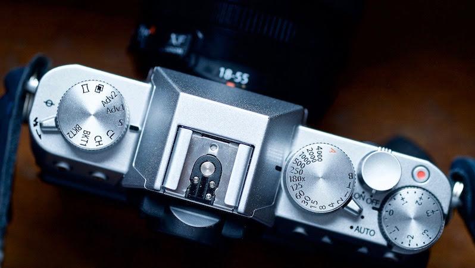

# Episode #2 of 10 - The Different Modes on Your Camera

Today, we'll be looking at the different modes on your camera—specifically auto, program, shutter priority, and aperture priority. Have a look in your camera's instruction manual to see how to select the modes.

## Auto mode

In auto mode, the camera will choose all the settings for you. This option is great for beginners to get used to composing photographs and handling your camera without having to alter any of the settings. However, your camera and you are capable of so much more, which is why we have the following modes available to us.

## Program mode

Program mode allows manual control of the flash, exposure compensation (see below), and other camera-specific modes (like sports or landscape). This mode varies by camera, so refer to the camera manual for more information.

## Shutter priority

In shutter priority, the shutter speed is chosen manually, and the camera will then set the aperture and ISO. Use this setting to photograph a fast-moving object (such as a car, which would need a fast shutter speed) or to photograph water with a smooth effect (such as a waterfall, which would require a slow shutter speed).

## Aperture priority

In aperture priority, the aperture setting is chosen, and the camera will then set the shutter speed and the ISO. The aperture controls the width of the aperture blades in the lens, and more light gets in with a wider aperture, which is useful in low-light situations.

## Exposure compensation

Most cameras have an exposure compensation dial to complement the other modes. Using the exposure compensation dial, you can choose to override the camera settings and make an image lighter or darker. Set the compensation to any of the + figures to lighten the image and - to darken it.

So grab your camera and let's get shooting. It doesn't matter if it's inside or out or what the subject is, just play with the different settings on your camera. Have a look at the results and see which you like best.

In tomorrow's lesson, we will be discussing using the manual settings on your camera. We will expand on how the shutter speed, aperture, and ISO affect the image and will experiment with going fully manual!
