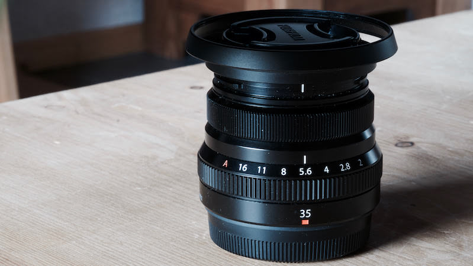

# Episode #3 of 10 - The Manual Settings

We've already looked at controlling some of the settings on your camera in yesterday's lesson. In today's lesson, we'll learn how to set the exposure manually.

There are three settings that control how your photograph will be exposed. When referring to exposure, we are talking about how light or dark the photography will be.

	"When referring to exposure, we are talking about how light or dark the photography will be."

## The three settings:

- Shutter speed - the higher the number, the quicker the shutter and the darker the photograph
- Aperture - the higher the number, the darker the photograph (listed as *f* numbers)
- ISO - the higher the number, the lighter the photograph

Refer to your camera manual and put your camera into manual mode for all three settings.

Set the shutter speed to 1/500 (that is one 500th of a second), the aperture to *f*5.6, and the ISO to 400. These are my default settings for outdoor photography, and I alter them depending on the light conditions and the effect I am trying to get. Take a photo outside. Have a look at it on your LCD screen—is it too dark or light?

# Too dark?

- Slow the shutter speed down. Keep slowing it down until the image can be seen on the LCD screen. Having a slow shutter speed might make the image blurry. If so, put the shutter speed back to 1/500 again.
- Now change the aperture to a lower number. Keep going until you can see the image in the LCD screen again. You may notice when you have your aperture at a really low number that the background of your photograph looks blurry. This is called bokeh and is a desirable effect to make your foreground subject sharp and the background soft. Put the aperture back to *f*5.6.
- Change the ISO to a higher number; keep going until the image looks right. You many notice that this has introduced "noise" to the image so that it looks grainy.

Reverse the above settings if the image was too light. Each setting affects the image in different ways (as well as the exposure level, as you can see from above). The shutter speed may introduce motion blur if it's too slow, the aperture may blur out the background, and the ISO may introduce noise; the art is to find the balance to create the effect you want for your image.

Sounds complicated, but it's not. Just go out and play with your camera. Alter the settings one at a time and see how it affects the image.

Tomorrow's lesson will be on how to compose a photograph—learning and then breaking all of the rules!
