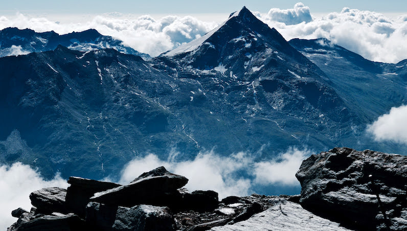

# Episode #4 of 10 - Composition

Today's lesson is all about composition. Composition is the arrangement of the photograph, where to place your main object, and how to make it pleasing to the eye. There are lots of “rules” around composition, which we will discuss, but rules are made to be broken (or at least bent a bit…).

## The rule of thirds

Imagine this grid of nine placed over your image. The idea of this rule is that you place your main subject at one of the four intersections of the lines. This makes the composition interesting and pleasing to the eye.

The train is off-center, which draws the eye of the viewer into the image.

## The golden ratio

This rule is all about curves. Think bendy paths and roads, close-ups of plates or cups, or the human face. Looking at the diagram below, we can see the curves forming an ever decreasing pattern. The idea is to take a section of the diagram and apply it to a composition.

So you could have a path leading in from the bottom left corner of your image sweeping up to the top, or you could have a portrait of a face in the top right corner. Just to make things interesting, you can rotate or mirror this image any way you want, so the sweeping path could come in from the bottom right.

The lake in this image makes a pleasing curve at the bottom left corner.

## Triangles

Having images that are made up of triangular sections makes for nice composition. Think three triangles placed into the image next to each other. This is great for landscapes but can also work for close-up images like macro shots or flat lays.

The big mountain forms a strong triangle, breaking the image into three larger triangles. The rocks in the foreground also form 3 rough triangles.

## Threes

Three objects can be arranged in many different ways in a composition but always seem to look better than two or four. This is easy to do with still life (fruit, candles, or food dishes) but also bear it in mind with people, animals, and vehicles too.

So these rules all have their place, and it's good to know them. However, they are more guidelines than rules and are made to be broken. Bear them in mind when composing your image, but if you find that you prefer two objects or your subject to be in the center of the image, go for it!

Three buoys bobbing in the water draw your eye to the boat in the background.

## Go the extra mile

This is my own rule. Try to think of situations that other people wouldn't bother with. Go out in the rain, get up super early, or hike off the beaten path to look for that shot. Also, think of different angles to take a photograph from. Lie down in the dirt, climb onto a large rock, or scramble into a bush. Obviously, don't put yourself in harm's way—I wouldn't recommend lying down in a road, for example—but just try to take the photograph from an unusual angle. That way, photographs will look different from other people's, even if the images have the same content.

I was hanging over the top of a wall in a museum (getting some very strange looks) to get this overhead shot.

Tomorrow, we will be investigating the best light to take photographs.
