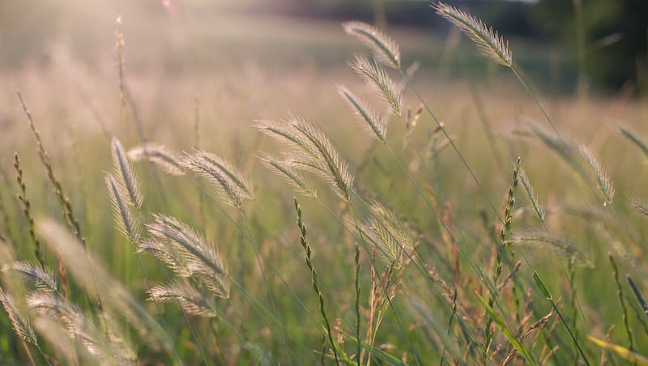
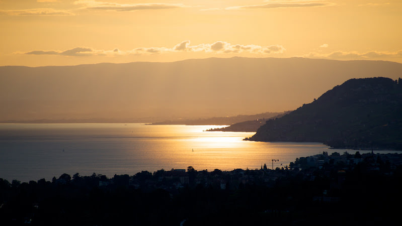
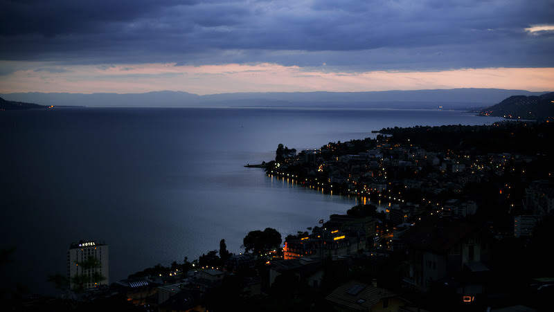

# Episode #5 of 10 - Golden Hour and Blue Hour

There are four times a day when the light is just right for taking photographs outdoors—these are known as golden hour and blue hour. They occur in the hour before the sun rises (blue) and the hour after (golden) and the opposite in the evening—an hour before the sun sets (golden) and the hour after (blue).

## Golden hour

This is the most well-known of the two hours, when the sun is low on the horizon and casts a golden hue over the land. It's excellent for sunrise and sunset shots but also lovely for people, landscapes, and city shots.

## Blue hour

The hour before the sun rises or after the sun sets turns lighting blue. This is a great time of day to capture city shots, because the blue hue and the street lighting make a good contrast. The blue hue gives everything a cooler look and is better for cities, landscapes, and seascapes.

These two photographs are of the same coastline at Montreux, Switzerland taken about an hour apart. The light at golden and blue hour is both soft and flattering.

Use a weather application or website to check the sunset/sunrise times for the location. It can also be very useful to know the sun's position to anticipate the composition before the sun rises. The weather plays a big part in golden and blue hour. Clouds can emphasize or diminish the light depending on where they are and how dense they are. Arranging a shot over water can increase the wow factor, as the light is effectively doubled in the water's reflection. Storms usually look great at either time of day.

**Top tip:** Try to stay overnight in a location so that you can be there for sunrise/sunset to get the best light for your images. Staying for a couple of nights will give you the chance to check out a location and the sun's position before you take the image.

City shots work well in both golden and blue hour. The sun setting at the end of a crowded street, shoppers bustling with hands full of bags, and the city waking up at sunrise can be lovely. There's also brake lights reflecting on a wet road during the blue hour, office lights in skyscrapers, and the hint of sunrise on a cityscape.

As with the previous lesson about composition rules, the golden hour and blue hour are not rules but rather guidelines. Bear these two times of day in mind, experiment, and have fun.

Tomorrow, we will be looking at photographing people. What are the best techniques and compositions? How do you stop people from looking stiff and formal?
