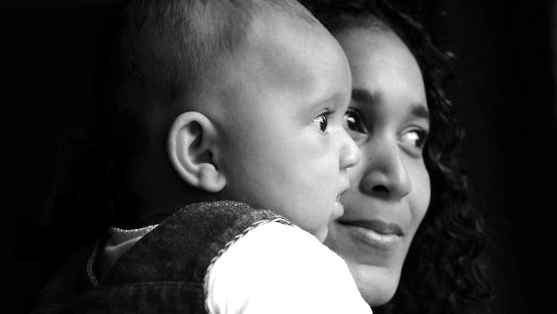
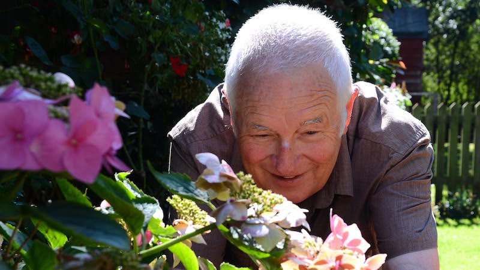

# Episode #6 of 10 - Photographing People

This lesson is all about how to get the best photograph of people. We will cover formal portraits, informal portraits, composition, and settings.

## The formal portrait

When capturing a formal portrait, the subject is usually in front of a plain background and facing a source of light. Facing the person toward a window will make the most of any natural light, which is flattering (especially during golden hour).

Posing the person is very important with the formal portrait so as not to emphasize double chins or baggy eyes! Position the person in such a way that your camera captures them in the most flattering way. Tilting the person's face slightly upward is a great start, and position the shoulders so their neck is not straining.

**Top tip:** Minimize clutter in the image by using a plain background such as a wall and compose the photograph so that the person takes up most of the image.

## The informal portrait

Go for an informal portrait if you want to catch a relaxed photograph full of personality. Lots of people hate having their photograph taken (me included), so try to capture them actually doing something that they like—a close-up of a gardener in the garden, a cook in the kitchen, or a golfer cleaning their clubs. Get the subject to move around while you are shooting, as this will allow you to capture a more natural posture and facial expression.

## Composition and settings

These two go together with portraits of people. Blur out the background to make the person the focus of the image with a wide open aperture setting (low number). Start at an *f*4 or *f*5.6 depending on the lighting conditions, because it may actually blur out part of the face if it is wider.

Focus on the eyes, as these are what we are drawn to as viewers. Set the focus to be either in the center of the face (if the subject is facing the camera) or the nearest eye (if off to one side).

Set the subject slightly off-center for the best composition, although this will obviously depend on the location and source of light. Slightly off-center meets the rule of thirds and is pleasing to the eye.

## Cheating

I like to sit down with the person beforehand to find out more about them, asking questions about hobbies and likes. During this time, I will be taking photographs with the pretense of checking my settings. If I'm lucky, this produces the best photograph, as the person is not posing or feeling stiff. It also allows me to get closer to people I don't know, removing some of the invisible barriers that make a stiff, formal photograph and allowing the person to relax a little.

Tomorrow's lesson will be covering landscape photography—how to capture a favorite holiday destination, the view from home, or just a beautiful scene in nature.

