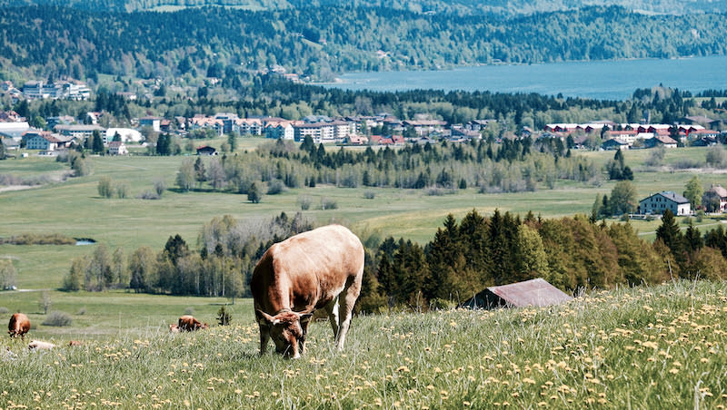
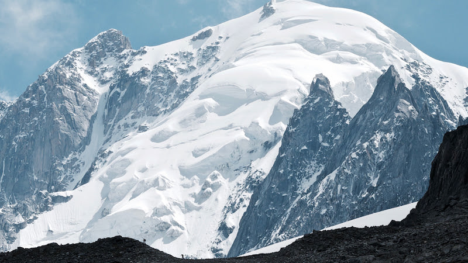
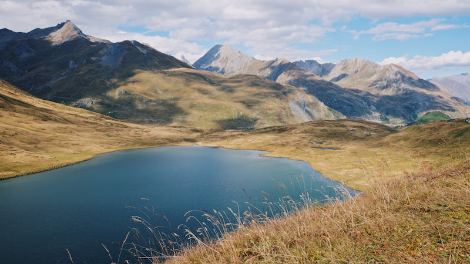

# Episode #7 of 10 - Photographing Landscapes

Landscapes are so varied, from water, grass, mountains, and skies to cities, urban areas, roads, and other man-made objects. There are several common factors for photographing landscapes.

## Composition and settings

It's really easy to see a lovely scene while out walking, capture it with a camera, but when reviewing the image later, find that it is a bit boring. Maybe the camera didn't capture it as seen or the scene looks flat. This is where composition comes in. Stop and think about the image before pressing the shutter button and bear in mind that the camera tends to flatten out hills and mountains.

The tiny walkers on the ridge give this mountain a sense of scale.

A great way to add interest is to have something in the foreground, such as a rock, bridge, or interesting tree. Also, remember from the composition lesson to get down low, up high, peek out from behind a rock, put the camera on the floor—all of these will give a more interesting perspective than taking the image as you are standing.

The grasses in the foreground draw the eye to the lake and then to the mountains in the background.

Use either aperture priority or manual mode to set the aperture. Have a wide open aperture (low number) to focus on something in the foreground and let the background fall out of focus, such as with a flower. Have a small aperture (high number) to capture all the elements of the image in focus. Use landscape mode if your camera doesn't have either of these modes.

**Top tip:** Go to a photography site like [flickr.com](https://www.flickr.com/photos/juliarevitt) and have a look at the EXIF data on the images. EXIF data is the information from the camera, such as the shutter speed, etc. Some photographers remove this information, but a lot (me included) leave it public.

Tomorrow's lesson will be photographing action, from bikes or cars to football matches or ice skating.
