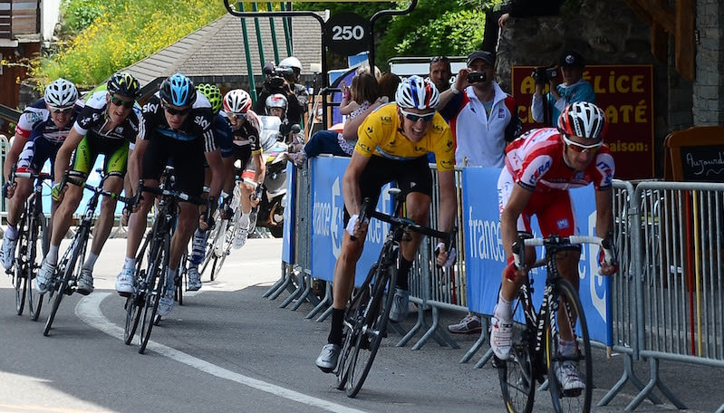

# Episode #8 of 10 - Photographing Action

Yesterday, we learned some tips for capturing great landscape images. Today, we will be concentrating on action shots. Think sports, cars in motion, dogs running—anything with a bit of speed.

## Settings

A fast shutter speed is needed to capture a fast-moving object in focus. Set your camera to sport mode, shutter priority, or manual mode to achieve this. Sometimes, we want to show the speed of the object by introducing a bit of blur to the image; this could be by blurring the background (see panning below) or blurring the wheels of a car. The speed of the shutter will determine whether there is any blur, so get experimenting! As mentioned in the last lesson, check the EXIF data on images that are similar to see the settings, then get out there and practice, practice, practice!

## Autofocus

It is best to use autofocus for action photography, as the camera can generally focus quicker than we can manually. Select continuous autofocus (if your camera has this), as this will allow the camera to track the moving subject and keep it in focus. Also, set the camera to single point focus, which will make the camera focus on the center of the image rather than trying to keep everything in focus.

## Burst

Burst mode or continuous shooting allows the camera to take multiple shots when the shutter button is pressed. This is great for fast-moving objects. How many shots the camera can take depends on how big the images are, how quickly the camera fills up the buffer memory, and how quick the burst mode is (frames per second). Use this mode to improve your chances of getting the shot.

## Panning

Panning is when the camera is moved with the subject to allow the background to blur out but keep the subject sharp, as in the image below. This is a great way to give the impression of speed in a static image. Panning is a technique that requires practice to get right but is not difficult. Hold the camera steady and then follow the subject with the camera while taking the shot. Look through the viewfinder to make sure the subject stays in frame, take a breath, hold it to reduce camera wobble (which could blur the subject), and press the shutter button.

Tomorrow's lesson will be about night photography. We will learn techniques for taking photographs in low light and at night.
