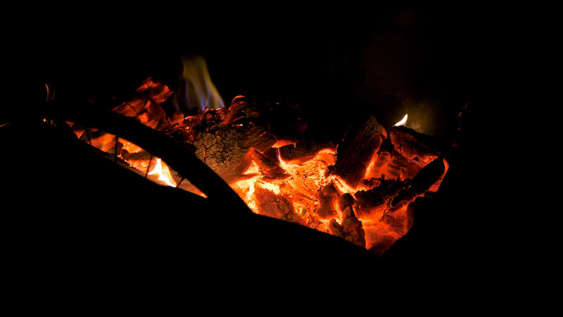
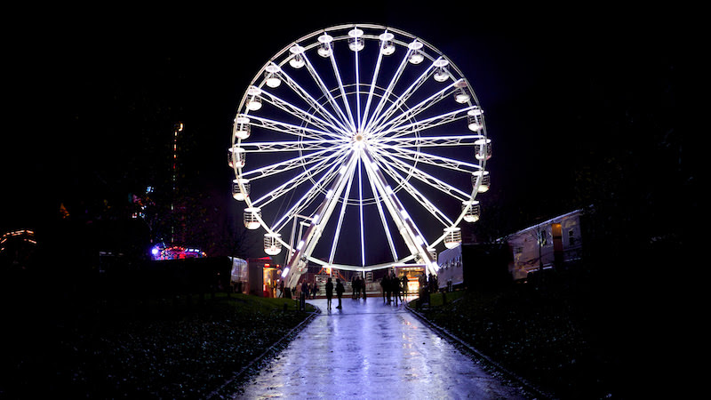

# Episode #9 of 10 - Night Photography

Yesterday, we looked at photographing action, and today, we're learning how to take shots at night or in low light.

I personally don't use artificial light in my images, as I prefer to make use of the natural light available. In low light situations, this means altering the camera settings to optimize the light. This can be done in a number of ways.

## Settings

Set the camera to night mode, aperture priority, or manual mode. Have the aperture set to wide open (low number) to allow the maximum amount of light to hit the camera sensor through the lens. Increase the ISO to improve the camera's sensitivity to light (having a high ISO can introduce noise into the image; see lesson 3 for more details). Decrease the shutter speed so that the shutter stays open for longer (you may introduce blur to the image if you have it too low; see lesson 3).

There are also a couple of tips that will help:

- Use a tripod or steady surface to reduce blur when shooting with a slow shutter speed.
- Use a remote control or self timer to take the shot, which will also reduce camera shake.
- Remove the lens hood.

These techniques work for most low light photography, including the night sky, parties, twilight, and duller indoor shots. Using natural light prevents the harsh light that light bulbs and flashes produce.

Tomorrow, we will be discussing equipment—what do you really need, and what can you do without?
