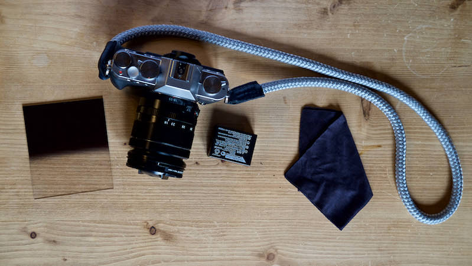

# Episode #10 of 10 - Equipment

Having lots of equipment doesn’t equate to taking good photographs. The only thing you absolutely should have is a camera of some sort. It doesn’t have to be expensive or big; it can be your phone in your pocket.

## Optional accessories

### Tripod

To take night or low light shots, the camera needs to be steady. The easiest way to keep it steady is on a tripod, but you could just rest it on a sturdy surface. I’ve only recently purchased a tripod, and before that, I used the kitchen table, books, the tops of walls—any steady surface. Tripods allow the camera to be angled, but you could just prop the camera at an angle using a lot of household objects such as place mats, kitchen implements, and clothing. Just make sure the camera is secure.

### Remote control

Remote controls are useful for night photography, as we discussed in the previous lesson. These allow you to take the shot without touching the camera, therefore reducing camera shake and the resulting blur. However, most cameras have a timer built in. Set this up, press the shutter button, and then walk away from the camera. No need for a remote control.

### Filters

Landscape shots are sometimes difficult to expose for. When the foreground is exposed correctly, sometimes the sky is too light, or if the sky is correct, the foreground is too dark. One of the ways to balance the two is to use an ND Grad filter. This is a piece of plastic that is dark on the top side and clear on the bottom. Place this in front of the lens with the dark side over the sky and then set the exposure for the foreground. There is no need to buy a full set of different gradients or even a holder to slot them in on the front of the lens, as you can just hold it there while you take the shot.

### Essentials

Spare batteries are useful, especially if you are travelling and are away from power outlets for long periods of time. Keep a fully charged battery in your pocket. It can be handy to have a cleaning cloth in your bag too in case you get water, dirt, or dust on the glass of the lens.

### Wrap up

So you’ve got the basics of photography nailed in ten lessons. Get shooting with your camera. Remember the basic rules, and then go break them. I hope you have fun, and I’d love to see your work! 

---

Follow me on Instagram [@juliarevitt](https://www.instagram.com/juliarevitt/) to see my latest images—photographs from the mountains of the French Alps to the London cityscape, from coffee shops to running shoes and everything in between. 
