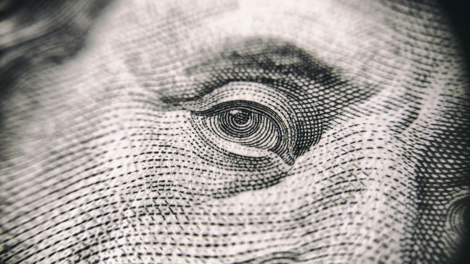

# Episode #01 of 12 - Compound Interest

	"There's no such thing as being too young to save." - My response to being told
	that saving at the age of 16 was pointless.

If you are young, you may not have started saving for your retirement. You may think that since it's more than 30 years until retirement, you have plenty of time to sort out your savings later. But time is your greatest asset as a young person, and compound interest shows you why.

Many believe that millionaires become millionaires by earning a high income. While income plays a role, it's not the whole story. No matter how high a millionaire's income is, the only way that they became a millionaire is by saving money. How much would you need to save every month from the age of 20 to retire a millionaire at the age of 65?*

**$190**

That's equal to…

...1 car payment

...3 semi-fancy dinners out for two

...10 Uber rides

Could you give up Uber to retire a millionaire?

What if you waited until you turned 30? How much would you need to save every month from the age of 30 to retire a millionaire at the age of 65?

**$435**

By waiting 10 years to start saving for retirement, you'd need to contribute an extra $245 a month to retire a millionaire. That's more than double what you'd need to contribute from the age of 20.

*Assuming a return of 8%

## Gratification: Instant and Delayed

If compounding interest can transform your money, why doesn't everyone use it? People do not use compounding interest to their advantage because they:

1. Get into debt
2. Live paycheck to paycheck (so they save $0)
3. Don't start saving money in their 20s

What's the running theme? People are susceptible to instant gratification. Instant gratification is the desire to experience pleasure or fulfilment without delay or deferment.

Overcoming Instant Gratification

Striving for delayed gratification will help you to spend less, save, and invest more money. You can overcome instant gratification by taking the following steps:

1. **Awareness**. Think about recent times when you have given in to an impulse. Examples might include:
   - ordering take-out instead of cooking at home
   - adding a chocolate bar at the checkout to your groceries
   - checking your phone in the middle of a conversation
2. **Reflection**. What was your state of mind when you gave in to instant gratification? Were you:
    - Tired
    - Stressed out
    - Sad
    - Happy
    - Hungry
    - Thirsty

**Address basic needs**. When you're in an emotional state or a basic need has not been addressed, you have less willpower, and you're more likely to give in to instant gratification to help remove that feeling.

## The Perfect Recipe

	"Adding time to investing is like adding fertilizer to your garden - it makes everything grow."

Compounding interest works at its best when you have two ingredients: time and regular contributions. If you have plenty of time and make regular contributions, you don't need to contribute as much money upfront and in the long run.

## Double Your Money: The Rule of 72

An easy way to calculate how much your money grows is by using the rule of 72. Take the interest rate of your savings and divide 72 by that number to figure out how many years it will take for your savings to double in value.

For example, if you receive 4% interest on your savings of $3,000:

**72 / 4 = 18**

After 18 years of saving and no further contributions, your $3,000 will turn into $6,000. Although many know that a higher interest rate on savings works in your favor, the rule of 72 demonstrates the effects of time on compounding interest.

## How Compounding Interest Works Against You

Debt. Take out any kind of debt that charges you interest and the longer you have the debt, the more you will repay in compound interest. If you take out debt, aim to get debt that charges 0% interest. If you can't get this interest rate, take out the debt for as short a term as possible (ideally less than one year). You'll read more about how debt compound interest works in **Lesson 5: Mortgages.**
