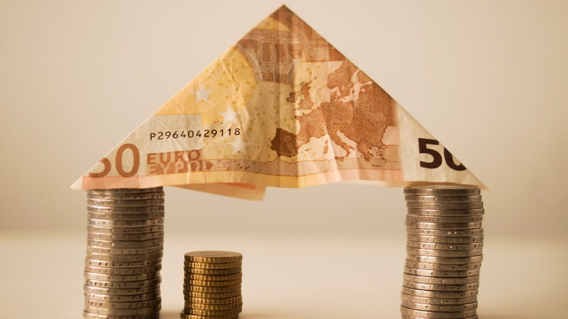

# Episode #03 of 12 - Emergency Fund

	"All days are not the same. Save for a rainy day. When you don't work, savings will work for you." - M.K. Soni

Imagine you have a nine-to-five job. You go to work five days a week, and at the end of the month, when you get your paycheck, you take $100 and put it into a savings account. At the end of six months, you have saved $600. During month seven, you take your car to the garage for its annual servicing. When you go to pick it up, you're told that you need to replace the brakes and that it's going to cost you $300. You need your car to commute to work because you rent an apartment outside of good public transport connections, so you use the money you've saved in your emergency fund (taking just half of it) and pay for the repair. You're back on the road in no time and your commute hasn't been disrupted.

What if you didn't have an emergency fund? How would you have covered the cost from your paycheck, considering you usually run out of money a week before payday? Would you have used a credit card to cover the cost and worried about paying it back later?

Unfortunately, paying for an emergency is a problem faced by thousands every day. More worryingly, according to a survey by Bankrate, two-thirds of Americans would struggle to pay for a $500 emergency.

## How Much Money Should You Have in an Emergency Fund?

The exact amount you should hold depends on your circumstances, but this table below gives you an idea:

| Age | No children/dependents                                                                                                                                                                               | Have children/dependents                                                                                                                                                                                                                                        |
| --- | ---------------------------------------------------------------------------------------------------------------------------------------------------------------------------------------------------- | --------------------------------------------------------------------------------------------------------------------------------------------------------------------------------------------------------------------------------------------------------------- |
| 18  | **3 months**. You should have the minimum in your emergency fund, but you also want to free up cash to invest for retirement to make the most of compound interest                                   | **6 months**. With children, you’re at more risk of not being able to afford the basics if you lose your job.                                                                                                                                                   |
| 25  | **6 - 12 months**. Since you’ve already been saving for retirement, you can put more into your emergency fund so that you have enough time and money to find a new job should you be made redundant. | **9 months**. With children, you’re at more risk of not being able to afford the basics if you were to lose your job, and you may have expenses like a mortgage. You may also have a car for your commute that needs repairs.                                   |
| 30  | **6 - 12 months**. Since your retirement fund is in good health, your main liability is your mortgage. If you lose your job, you can still make mortgage repayments.                                 | **12 months**. With dependents, a mortgage, a car, and potentially other big expenses to be saving for, e.g., retirement, with 12 months of emergency fund savings, you’re well cushioned if you’re made redundant from a senior position with a high paycheck. |

If you're single and you don't have a mortgage, a healthy emergency fund would be at least three months' worth of expenses. As soon as you take on extra costs like a mortgage, it's worthwhile increasing your fund for additional protection, especially if you have a mortgage and kids.

## When to Use Your Emergency Fund

Everyone faces unexpected expenses throughout their adult lives, but what constitutes an emergency? To make your emergency fund effective, it's best to be rigid about when you use your emergency fund. Here is what I ask myself before I dip into any emergency savings:

Have I just lost my main source of income? (For many, this will apply if you're made redundant.)

What's the consequence of not paying for this expense immediately? (Can you delay this purchase?)

Have I found the cheapest available option? (If your car needs to be replaced, you shouldn't be looking at an upgrade, you should be finding the most affordable equivalent or even looking for a more affordable model.)

When you withdraw any money from your emergency fund, it's essential to rebuild it as quickly as possible. It's not uncommon to have more than one emergency in the space of a few months.

**In summary**, building an emergency fund is an essential part of financial security.
