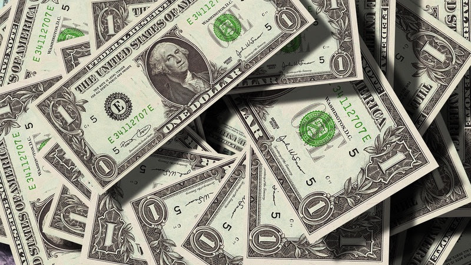

# Episode #04 of 12 - Inflation

	"Inflation is taxation without legislation." - Milton Friedman, Economist

When you switch to a news channel during the finance hour, you'll often hear about the S&P 500 going up or down. You're also likely to hear reporters discuss inflation. Inflation is the rate at which prices for goods and services increase. Inflation affects most people in the following ways:

- The interest rate we get on our savings accounts
- The interest rate we pay on our mortgages
- The interest rate we pay on student loan debt
- The amount of pension we can withdraw from social security (US) or national insurance (UK)

As you can see, inflation affects how much purchasing power our money has. If inflation is low, then we get more for our money. When it's high, our money has to go further to buy everyday goods. Inflation is expressed as a percentage. If inflation is 3% one year, then a loaf of bread that costs $1 one year will cost $1.03 the next year.

## Stability

Central banks attempt to limit inflation and avoid deflation to keep the economy stable. The Federal Government (the Fed) sets moderate long-term interest rates, price stability, and maximum employment. Keeping inflation under control and providing price stability helps businesses to plan for the future since they know what costs to expect.

## Deflation

While high inflation means consumers get less for their money, deflation is also harmful to the economy. Deflation is a decrease in the general price level of goods and services. A drop in prices may seem like a good thing, but while moderate drops in food or energy can have a positive effect on consumer spending, deflation can have a severe negative impact on growth and economic stability. Deflation often occurs after an economic crisis when consumer demand drops. With dropping demand for products, vendors are forced to drop their prices and liquidate (sell) their inventory. After liquidating their assets, consumers and investors hold on to their cash to protect themselves against further losses. When people save more money instead of spending or investing it, demand decreases even further. People then assume that prices will continue to decline and are further encouraged to hoard their money so that it can buy more in the future. Decreasing demand for consumption results in increased unemployment as companies seek savings via a reduced workforce.

## The Impact of Inflation on Everyday Life

Inflation might not always affect you, as you may not buy certain types of consumer goods and services. If you know what you spend your money on, though, you can use general pricing patterns to figure out when the cost of your purchases will increase. For example, air carriers often push up their fares in December in advance of Christmas and the New Year, so you'll often see prices jump in January.

Since, in real terms, the purchasing power of your money decreases every year, people use savings and investments to retain the value of their money over time. If your savings account pays 1% interest and inflation is 2%, the value of your money is still decreasing year on year by 1%. If you invest in a financial product that pays 5% interest and inflation is 2%, the value of your money is beating inflation by 3%, which means you're not only retaining your purchasing power but you're also growing your money in real terms.

**In summary**, factor in the rate of inflation when calculating your returns from savings and investments to maximize the purchasing power of your assets.
