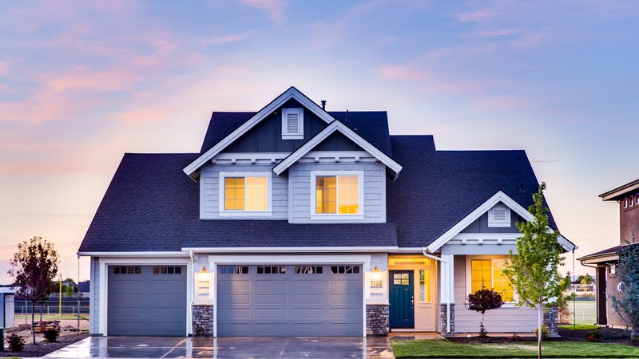

# Episode #05 of 10 - Mortgages Pt. 1

	"For too long, tricks and traps in mortgages, credit cards and other financial
	transactions have stripped wealth from working families." - Jeff Merkley, Politician

A mortgage is possibly the largest financial commitment that an individual will take out in their lifetime. More specifically, a mortgage is a legal agreement by which a bank lends you money to purchase a house. In exchange for the money lent, you are signing up to pay the money back at an agreed interest rate, and if you can't repay your mortgage, you will give up the ownership of the house to the bank to offset the debt owed.

A report from Pew Charitable Trusts shows that 80% of Americans have debt and that of those 80%, 44% have mortgage debt. So, why do so many of us hold mortgage debt? It's because most of us can't afford to buy a house outright. Even if we saved every penny we earned, with the average two-bed apartment in Buffalo, New York costing $200,000, we'd struggle to save even half.

## Downpayment

Downpayment is listed first because your downpayment can have a big impact on how much money you pay for your mortgage over the life of the loan. If you don't use a downpayment, you'll likely end up paying more interest over the term of your mortgage. Another reason that you would consider using a downpayment is to prevent you from falling into negative equity; when the value of your house goes down, you're still paying off the original amount that you borrowed, even though your house may sell for less than that.

The amount of downpayment depends somewhat on your circumstances, but most personal finance gurus suggest saving a minimum of 10% of the house price. Here's an example of how the deal varies based on the size of your downpayment on a $200,000 property on a 25-year mortgage term:

| Downpayment (%) |                   | Interest rate                          | Total repayment (capital and interest) | Total repayment of interest only |
| --------------- | ----------------- | -------------------------------------- | -------------------------------------- | -------------------------------- |
| 5               | 10,000            | 4.6%                                   | $316,206                               | $126,031                         |
| 10              | 20,000            | 4.3%                                   | $293,153                               | $113,013                         |
| 15              | 30,000            | 3.4%                                   | $250,636                               | $80,586                          |
| 20              | 40,000            | 3.3%                                   | $235,475                               | $75,425                          |
| 25              | 50,000            | 3.3%                                   | $220,368                               | $70,318                          |
| 30              | 60,000            | 3.3%                                   | $205,679                               | $65,629                          |
| 40              | 80,000            | 3.3%                                   | $176,303                               | $56,253                          |
| 50              | 100,000           | 3.4%                                   | $146,928                               | $46,878                          |

As you can see, the best interest rate is offered from downpayments of 20% or more. After this amount, the interest rate plateaus, but this doesn't mean you shouldn't use a higher downpayment. The bigger your downpayment, the more property you own from the start.

## Size

The amount of mortgage you take out depends on:

- The price of the property you wish to purchase
- Your downpayment
- What you can afford (according to the credit provider's criteria)
- Whether you choose to repay interest only or capital and interest

Tomorrow's lesson will go into more depth on other key details about mortgages.
