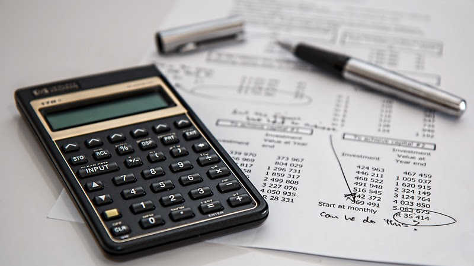

# Episode #08 of 12 - Credit Score

	"Nearly every financial decision you make is being watched, with the goal of
	determining your financial profile." - Suze Orman, Personal Finance Guru

Your credit score is what financial institutions use to determine whether to offer you credit, like a car loan or a mortgage. Each time you apply for credit, your application is recorded on your financial profile.

In the US, the Fair Isaac Corporation (FICO) firm created the formula widely used to determine your credit worthiness. Credit scores in the US are often referred to as a FICO score, a three-digit number ranging from 500 to 850. 500 is the lowest (worst) FICO score, which means lenders deem you a risky candidate for credit, and 850 is the highest (best) FICO score, which means lenders deem you a safe candidate for credit. The importance of your FICO score is best explained by the interest rate that financial institutions will offer you on your mortgage.

The table below shows the rate you might pay on a 30-year fixed-rate mortgage based on your FICO score in 2014.

## Does Everyone Have a Credit Score?

Whether you’ve taken out credit or not, you will have some kind of credit score. If you’ve never applied for or taken out credit, you’ll likely have a low credit score. This may sound counterintuitive, but without any history of credit, FICO cannot assume that you are good with credit.

These are some financial actions that count toward your credit score:

- Taking out a phone contract
- Paying for utility bills
- Student loan repayments (US)
- Credit card repayments
- Loan repayments
- Being registered to vote (UK)

## How to Improve Your Credit Score

Improving your credit score is a gray area. Since FICO isn’t 100% transparent about how they calculate your credit worthiness, it’s difficult to know what can improve it.

Many debate that the following actions can positively affect your credit score:

**Pay on time**. Pay your bill at least five days before it is due to ensure the payment reaches the creditor on time. Set up an automatic payment online. It’s best to pay your balance off in full every month, but at the very least, pay the minimum.

**Manage your debt-to-credit-limit ratio**. Add up all of the outstanding balances on your credit cards and loans (not what is in your checking or savings account). Calculate the credit limit on each card or loan (the maximum amount that the lender will allow you to spend on the card or loan). The lower the ratio, the better. There is no cutoff on what counts as a good ratio. Just keep it as low as possible, so borrow way less than you can.

**Protect your credit history**. The longer your history, the better. If you decide to cancel any cards (and space out when you cancel/apply for credit), cancel the card that you've had for the least amount of time. If you're worried about using any old card, don't cancel it, just cut it up.

**Create the right credit mix**. Don't apply for a lot of new credit cards or loans at once. Having a mortgage, retail card, credit card, and installment loans that you pay off every month will help agencies measure your creditability.

Another school of thought argues that credit companies ultimately want to make a profit from their customers, so having a squeaky clean profile could work against you.

## Checking Your Credit Score

You can access your credit score for free by signing up for a trial from Experian or Equifax. Set the date on your calendar to cancel your subscription or you’ll start paying the monthly fee, even if you don’t access your score again. In the US, check [this link](https://www.usa.gov/credit-reports). You can get a free credit report every 12 months.

**In summary**, know what your credit score is and how your financial actions affect it.
