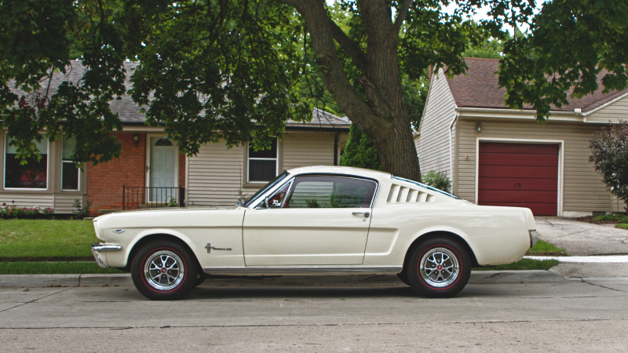

# Episode #09 of 12 - Leasing a Car

	"I'd buy a two- or three-year-old car any day over a new car, because someone
	else broke it in and took a bunch of depreciation with them." - Erik Folgate,
	Money Crashers blog

Like houses, people don't always have the cash to buy a car outright. Financing a car requires an initial deposit, which some struggle to save up, so leasing becomes an attractive option. Leasing a car means you can "purchase" a car for a low monthly payment that's typically lower than the monthly payments when buying on finance. When you lease a car, you get a new car for a fixed period, like three years. After those three years, you can purchase the car outright or continue your lease for another three years and get a new car.

Unlike borrowing for a house where the value can go up or down, borrowing for a car will instantly put you into negative equity. Cars lose their value as soon as you drive them out of the dealership.

## What's the Difference in Cost?

To make an informed decision, here's a breakdown of the costs of each of our options if we decide to purchase a reasonably priced car:

	Price of car: $4,500
	(Buying on finance over 36 months and leasing over 36 months)

| Cost         | Outright | On Finance (0% APR) | On Finance (5.4% APR) | Lease (5% interest) |
| ------------ | -------- | ------------------- | --------------------- | ------------------- |
| Initial cost | $4,500   | $2,250              | $450                  | $450                |
| Monthly cost | $0       | $62.5               | $121.88               | $204.64             |
| Overall cost | $4,500   | $4,500              | $4,837.5              | $5,469.64           |

You can also use online calculators for tailored results. I used the [Car Finance Calculator](https://www.carfinance247.co.uk/car-finance-calculator) and [Auto Lease Calculator](http://www.calculator.net/auto-lease-calculator.html).

## The Cost of Repairs

After 36 months of the lease, you can trade in your three-year-old car for a newer car and continue to pay your lease every month. Repairs are costlier the older your car gets. Since you get a new car every few years, the cost of repairs when leasing could be lower.

However, since you don't own your leased car, you're responsible for returning it under the following conditions:

1. **Pristine**. If there's a functional issue, it's a no-brainer to get it fixed when you own a car. If there's aesthetic damage, like a dent from a minor collision, as the car owner you have the option of repairing the damage or not repairing the damage. If it doesn't affect the function of the vehicle, owners might delay repairs. With a leased car, you must fix everything, both functional and aesthetic. If you turn the car in without fixing everything, you'll receive a large bill.
2. **Mileage**. You're required to only drive a certain number of miles every year as determined by your lease. If you're only allowed to drive 15,000 miles per year and you go beyond this, you'll pay a large per-mile penalty when you turn the car in.
3. **Servicing**. Some leases require you to get your car serviced by the manufacturer, meaning you can't use your local discount garage. For example, leasing a Mercedes often means you'll have to go to a Mercedes-approved garage for servicing and repairs.
3. **Exit**. If you own a car but no longer need it, you can sell it. If you lease a car, you'll have to pay a penalty for ending the lease early.

**In summary**, consider the implications of getting a car on a lease, and if you can, avoid purchasing any car new. Let someone else take the hit with this depreciating purchase.
