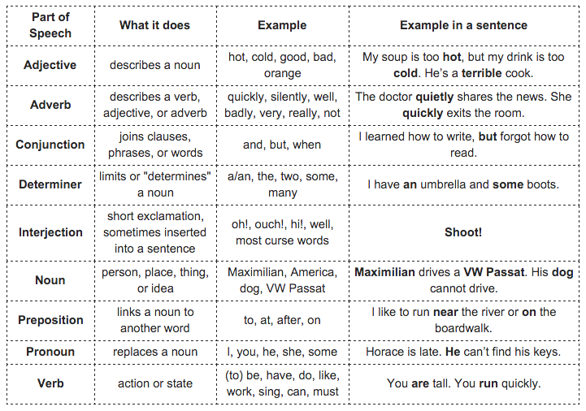

# Episode #3 of 10 - Sentence Structure

You've got your building blocks at the ready—now let's learn how to lay them out in order to build something meaningful.

This chart helps with the basic parts of speech:

There are 4 basic types of sentences:

- Declarative sentence: A statement | I enjoy driving quickly.
- Imperative sentence: A command | Drive faster.
- Interrogative sentence: A question | Why aren't you driving faster?
- Exclamatory sentence: A sentence that expresses great emotion | Slow down!

All sentences have a subject and a predicate. That is, all sentences have someone or something (subject) and what it is they're doing (predicate). There's a star and there's action.

There's a lot more to basic grammar and sentence structure but not nearly enough space or time to go over it. Mastering these rules is a great first step, but I encourage you to explore English grammar on your own.

[Source](https://www.englishclub.com/grammar/parts-of-speech-table.htm)
