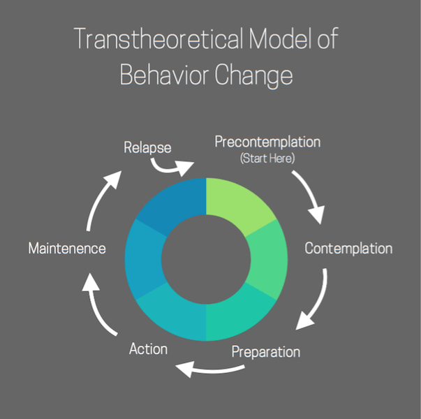

# Episode #1 of 10 - Are You Ready? Understanding Behavior Change

Welcome to the course!

I am thrilled that you are going to be joining me for 10 lessons about weight management. Deciding to take control of your weight (and of course, your health) can sometimes feel vulnerable and awkward because it’s such a personal topic. Know that these lessons provide a safe place to learn skills that will assist you on the journey and ultimately lead you toward confidence in managing your weight. My name is Aimee Frazier, and I am a health coach, personal trainer, and owner of [Emerge Health Coaching](http://www.emergehealthcoaching.com/). I have worked with hundreds of people to achieve their goals and overcome obstacles that have prevented them from seeing lasting results in the past. As always, you should talk to your doctor before beginning any new exercise or diet.

Our first few lessons will go over the practical components of weight management by addressing the three biggest factors of managing weight: diet, exercise, and controlling emotional eating. The other lessons will go over some topics that can be pitfalls for some people when trying to manage their weight. We focus on these topics so that you can proactively address the risk factors that pull people off track.

Here is an overview of the lessons of this course:

1. Are You Ready? Understanding Behavior Change
2. Eating for Weight Management
3. Managing Stress Without Eating
4. Developing an Exercise Plan
5. The Secret Math of Calories
6. Tackling Your Goals
7. Tracking Your Progress
8. Planning Ahead
9. Developing a Support System
10. Taking Inventory and Staying on Track

In today’s lesson, we will focus on behavior change. You’ll learn the stages of behavior change and be able to see what stage you are on the readiness to change scale.

The transtheoretical model was designed by experts from different fields who came together with the belief that behavior change is holistic and needs to address the physical, psychological, and environmental components that factor into making lasting behavior changes. The model shows the stages of progression of making a behavior change. As you read through the stages, try to identify which stage you are in right now.

## The stages of behavior change are:

- **Precontemplation**: Unaware of any weight management issues that could have a negative impact on life.
- **Contemplation**: Aware of the consequences of not taking actions and beginning to consider making changes.
- **Preparation**: A desire to make changes to improve weight management. May begin planning the practical steps of how to achieve the goal of addressing weight management.
- **Action**: Actively making changes to behavior to manage weight.
- **Maintenance**: Sustaining the behavior change over long periods of time.
- **Relapse**: Reverting to old habits. Person often returns to precontemplation phase.

Where do you fall on the chart? Many of the tools that you will find throughout the next nine lessons will allow you to move from contemplation into action. If you’re already taking steps to manage your weight, these lessons can help you to refine your strategy to be even more effective. Keep in mind that the tools you learn in these lessons will look different; some tools will be practical and knowledge-based, like calculating calories. Other tools will be psychological, such as techniques for managing stress that could otherwise lead to emotional eating. Still other tools will be based on practical, research-based recommendations, like gaining support. We want to address every factor that will lead to your success in managing your weight.

In tomorrow's lesson we will go over the most important factor for managing your weight: eating healthy. You’ll gain an understanding of the basics of what to eat and why it’s so crucial in managing your weight.

Cheers to your health, Aimee
