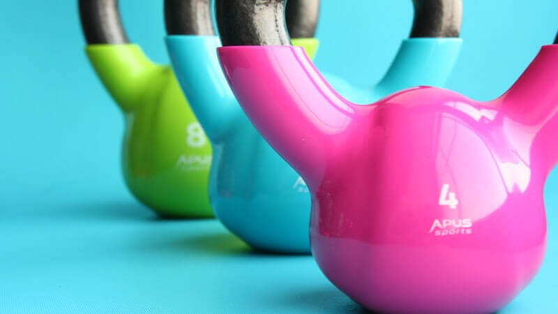

# Episode #4 of 10 - Design Your Exercise Plan

Welcome to Lesson #4! Today, the focus is on exercise, which is another important factor of weight management. By the end of the lesson, you will understand how the body uses fat storage to provide the body with energy (thus reducing body weight), and you’ll begin to develop your exercise plan.

## What is Going on in There?

Imagine you are going to be moving to a new house and you want to get rid of some old, unused items that you had stored in boxes in the basement. You find the boxes and begin dusting them off, peering at the contents within. You begin taking out old items that you no longer want and make a donation pile on the basement floor. You then put those items into bags and carry them out of the house and to the donation center.

That is what happens to your stored fat when you exercise. When you work out, you literally begin breaking up your storage of energy (the fat), and once it’s broken up, it is converted into energy and is then exhaled and excreted through carbon dioxide, sweat, and urine. This [video](https://www.youtube.com/watch?v=C8ialLlcdcw) does a great job describing the process! Exercise will give you an opportunity to use stored body weight as energy, thus reducing your overall weight; most importantly, exercise will increase your overall health.

## Another Reason Your Body is Awesome

The human body has the incredible ability to adapt to almost anything!

Every time you work out, there are physiological changes that take place in your body that help it to become more functional and adapt to the activity. The SAID principle is an acronym that stands for Specific Adaptations from Imposed Demands. Essentially, this principle states that anytime you place a demand upon your body, the body responds by changing itself to accommodate that demand. Here are some examples of those changes:

- When a bodybuilder lift weights, the strained muscles develop small micro-tears. These small tears send signals to the body to grow back stronger to meet the demands being placed upon it, thus increasing performance, strength, and muscle size!
- When a runner goes for a jog, their body sends a signal stating, “Hey it’d be nice if I could have more oxygen—this is hard!” The body responds by creating more red blood cells (which deliver oxygen) to help the body become more efficient at meeting the demands placed upon it. These changes allow a runner to increase their endurance.

The body is an incredible machine that we each get the honor of operating!

## Do What You Enjoy

Someone once said, “The best exercise is the one that you will actually do.” Keep that in mind when designing your exercise plan—make sure to find an activity that you enjoy and could see yourself doing long-term. If you have a hard time enjoying or following through with getting exercise, it may be helpful to work out with a friend, hire a personal trainer, or work with a health coach.

First, you’ll need to determine what activities you enjoy the most that you can see yourself doing long-term. If you’re not sure what you enjoy, this is your chance to sample the buffet of different activities. Once you’ve found one that you like, you’ll need to make time for it in your schedule. [The American Heart Institute](https://www.heart.org/HEARTORG/HealthyLiving/PhysicalActivity/FitnessBasics/American-Heart-Association-Recommendations-for-Physical-Activity-in-Adults_UCM_307976_Article.jsp#.WL8l5xLyumk) recommends people get at least 30 minutes of moderate exercise five days per week. If you have a full schedule, it may be helpful to look at taking two 15-minute breaks to exercise during the work day. Now take out your calendar and schedule when you can commit to working out!

## Summary

In today’s lesson, you learned how the body changes in response to the demands that are placed on it, including how it burns fat as a fuel source. You also learned about the ideal frequency of working out and scheduled time for exercise in your schedule. In our next lesson, we will dive into understanding calories and the math behind weight management.

Cheers to your health, Aimee
