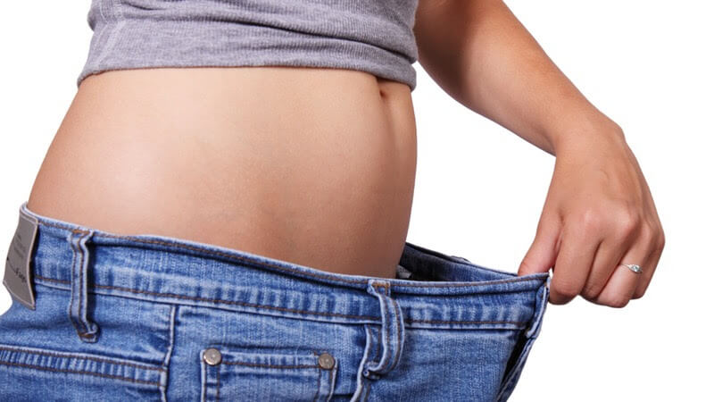
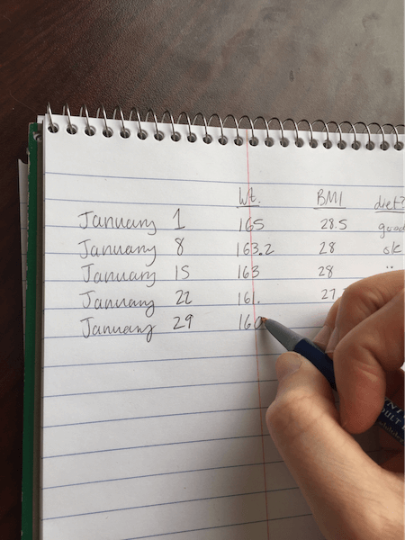

# Episode #7 of 10 - Tracking Your Progress

**“YEEEESS!”** Mark yelled joyously, grinning and raising his arms in a victory pose. He had just stepped off the scale and saw that he had lost the last five pounds toward his goal. Mark is someone I had worked with for months, and he had stopped by to visit me once a month to track his progress by stepping on the scale, measuring his body fat, chatting about his progress, and making adjustments to his exercise plan. His hard work had finally paid off!

As with any goal, it’s extremely important to track your progress. Tracking will objectively allow you to see the fruits of your labor and give you something to celebrate! In long-term goals, such as weight management, it’s important to have a tool to measure progress.

## What Should I Track?

For weight management, it’s important to track your weight once a week. You’ll need to use a scale. Be sure to weigh yourself at the same time each week. Measuring in the morning is the most consistent, because the body hasn’t just eaten a meal. It is also helpful to track your BMI. BMI is a ratio of your height and weight, which will allow you to see if you are in the “healthy,” “normal,” “overweight,” or “obese” categories. You can calculate your BMI using this [tool](https://www.nhlbi.nih.gov/health/educational/lose_wt/BMI/bmicalc.htm). As your weight changes, your BMI will as well. Tracking weight and BMI are essential for knowing if you’re seeing results. You can keep a record of your weight using an app or using an old-fashioned method like pen and paper.

Some people find it helpful to track additional measurements, because it allows them to see more specific information, such as what areas of their body are losing fat and/or gaining muscle.

Here are some optional measurements you can take:

- Progress photos (front, side, and back).
- Inches with a tape measure. You can find out how to [measure your inches here](http://www.superskinnyme.com/body-measurements.html).
- Body fat percentage. Using [fat-pinching calipers](https://www.amazon.com/Durable-Personal-Calipers-Fitness-Measure/dp/B00M7VHGKM/ref=sr_1_1?s=industrial&ie=UTF8&qid=1488483463&sr=1-1&keywords=body+fat+calipers) is the cheapest way to measure your body fat.

## Celebrate

When you see that you’re making progress in managing your weight, you should celebrate! Seeing results in your tracking means that your hard work in developing new healthy habits is paying off. How do you celebrate? That’s up to you, but experts recommend that it’s something healthy; don’t go out and order an unhealthy meal. Treat yourself to a new shirt, tell a family member, give yourself $5 to spend on a fun item, or, if you’re brave, post your progress on social media!

Today we talked about the importance of tracking your progress. In our next lesson, we will go over one thing that often deters people from sticking with their weight management goals long-term: not planning ahead. You’ll learn some tips and tricks for planning ahead so that you can stay on track with your goals.

Cheers to your health, Aimee
