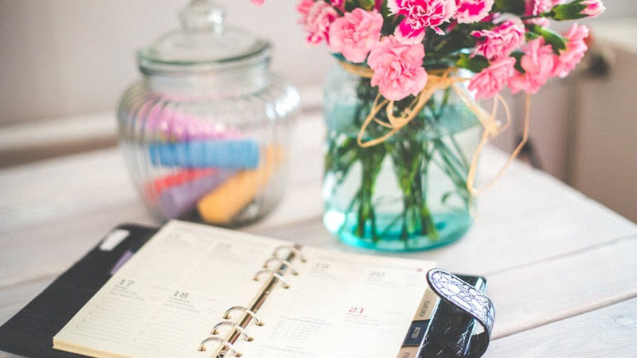

# Episode #8 of 10 - Planning Ahead for Success

Have you ever tried to give a presentation without preparing? Chances are that you survived, but it was a lot less impactful than it could have been. Planning ahead allows for the opportunity to maximize potential. Today’s lesson will focus on four ways you can plan ahead for successful weight management. The more you’re able to plan ahead, the higher your chances of being successful in managing your weight.

**Set aside a block of time one day a week to map out your meals.** During this time, find healthy meals that you would like to eat over the next week for breakfast, lunch, and dinner. Add the ingredients to your grocery list and take your weekly shopping trip. If you have a busy week, it may be helpful to prep your food ahead of time by cooking before the work week begins.

**Put your physical activity on the schedule.** Plug in some space on your calendar to do activities that you enjoy and that give you exercise. Maybe you can set time aside on a lunch break to go for a walk or join a bowling league that meets once a week. Find something that is realistic to commit to and go for it!

**Anticipate what could come up during the week that could get you off track.** Are there any work events that will cause a major temptation? Could there be any stressful interactions that that could trigger emotional eating? Take a few minutes to imagine how you would like those events to go in your ideal world and how you can set boundaries to stay on track with your goal of managing your weight. If it’s helpful, set a reward for yourself if you’re able to overcome a challenge: *I can have one small slice of cake at the work party on Tuesday, and if I only have just one, then I can watch my favorite show on Netflix after the party.*

**Eating Out?** If you have plans to eat out at a restaurant or somewhere that you would like to indulge more than usual, you can plan ahead to make calorie adjustments earlier in the day. Having a smaller lunch and afternoon snack can help balance out a higher-calorie dinner.

Do you have an idea of how you can plan ahead? Good. Now take out your calendar and get to it!

Cheers to your health, Aimee
